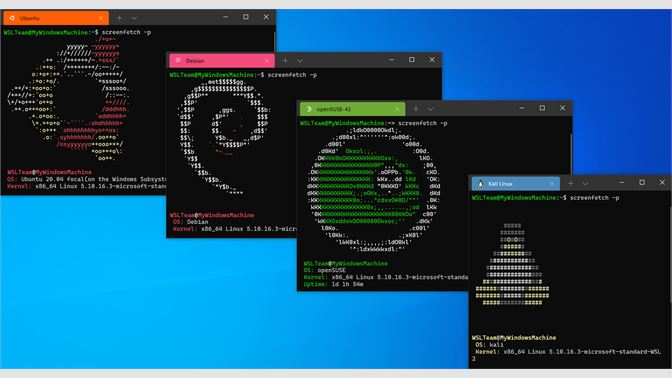

## Windows Subsystem for Linux

WSLの正式名称は`Windows Subsystem for Linux`。 
Windows上でLinux環境を扱うための開発者向けサブシステム[^1]。 
現在メジャーバージョンは`2`なので、WSL2と表現されることもある。 
WSLとWSL2は仕組みが異なるため本来は区別が必要だが、断りがない限りこの勉強会の中ではWSL2のことをWSLと表現する。

[^1]: 詳細は公式ページ「[Windows Subsystem for Linux に関するドキュメント](https://docs.microsoft.com/ja-jp/windows/wsl/)」を参照。

<figure markdown>
  { width="500" }
  <figcaption>WSL</figcaption>
</figure>

## WSLの大まかな仕組み

完全なLinuxが搭載された仮想マシン（VM）がWindows上に構築されることで、WindowsでもLinuxのコマンドを利用できるようになる。

### 仮想マシン（VM）とは

ざっくりというと仮想的なPC。 
対比として普段我々が使用しているPCを物理PCと表現することもある。 
VMは単体では存在せず、VMをホストする物理PC上に存在する。

<figure markdown>
  { width="500" }
  <figcaption>VMのイメージ</figcaption>
</figure>
